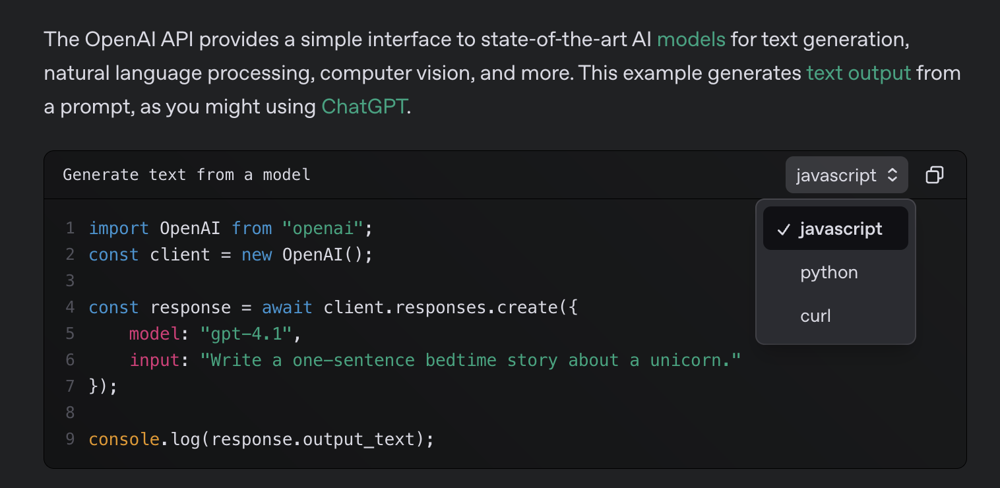

# Homework: Summarized Memory

**Individual Exercise: 2 hours**

This homework builds upon the code you started in lab 2. You can work in a Jupyter Notebook or a local project, whichever you prefer.

You can start with the code you wrote in that lab, or you can use the solution code provided at the end of that lab:

## Starter Code

```python
import tiktoken

class TokenManager:
    def __init__(self, model, max_tokens):
        self.encoding = tiktoken.encoding_for_model(model)
        self.max_tokens = max_tokens
        self.tokens_used = 0

    def exceeds_limit(self):
        return self.tokens_used >= self.max_tokens

    def add_tokens(self, messages):
        num_tokens = 0
        tokens_per_message = 3
        tokens_per_name = 1

        for message in messages:
            num_tokens += tokens_per_message
            for key, value in message.items():
                num_tokens += len(self.encoding.encode(value))
                if key == 'name':
                    num_tokens += tokens_per_name

        num_tokens += 3  # every reply is primed with <|start|>assistant<|message|>

        self.tokens_used += num_tokens

    def reset(self):
        self.tokens_used = 0


class Message:
    def __init__(self, role, content):
        self.role = role
        self.content = content

    def to_dict(self):
        return {'role': self.role, 'content': self.content}


class ChatHistory:
    def __init__(self):
        self.messages = []

    def add(self, message):
        self.messages.append(message)

    def to_list(self):
        return [msg.to_dict() for msg in self.messages]

    def clear(self):
      self.messages = []


class ChatManager:
    def __init__(self, model, system_prompt):
        self.model = model
        self.history = ChatHistory()
        self.system_prompt = system_prompt
        self.history.add(Message('developer', system_prompt))
        self.client = OpenAI(api_key=API_KEY)
        self.token_manager = TokenManager(model, 300) # Low token limit for testing

    def get_response(self):
        response = self.client.responses.create(
            model=self.model,
            input=self.history.to_list()
        )
        return response.output_text

    def run(self):
        print("Welcome to ChatGPT-like Application!")
        print("Type 'exit' or 'quit' to end the conversation.")
        print("-" * 50)

        while True:
            user_input = input('You: ')
            if user_input.lower() in ['exit', 'quit']:
                print("Goodbye!")
                break
        
            print(f'You: {user_input}')

            self.history.add(Message('user', user_input))
            self.token_manager.add_tokens(self.history.to_list())

            if self.token_manager.exceeds_limit():
                print("Conversation limit reached. Please start a new conversation.")
                print("Clearing conversation history...")
                print("-" * 50)
                print("Welcome to ChatGPT-like Application!")
                print("Type 'exit' or 'quit' to end the conversation.")
                print("-" * 50)

                self.history.clear()
                self.token_manager.reset()
                self.history.add(Message('developer', self.system_prompt))
                continue

            print("Thinking...", end="\r")

            response_text = self.get_response()
            print("Assistant:", response_text)

            self.history.add(Message('assistant', response_text))
            print("-" * 50)


SYSTEM_PROMPT = "You are a helpful assistant."
chat = ChatManager(MODEL, SYSTEM_PROMPT)
chat.run()
```

## Requirements

Here are the requirements for your homework lab:

### Part 1: Maintaining Memory

Right now, when we reach our token limit, we simply clear the chat history and start with a blank slate. This isn't very helpful when you're in the middle of a conversation! Your task is to fix this such that:

- Our token count is reset.
- When the new conversation is started, we maintain some context from the previous messages.

How you go about this is up to you. Our rules for tracking tokens are quite arbitrary anyways, so you can even change these if you'd like. Maybe instead of limiting tokens for a conversation, you limit the token count per message. The goal is to implement some form of memory management while limiting the number of tokens used.

**Here's a suggested approach you can take:**

1. Tally tokens for a conversation, including previous messages in the API call to give the conversation context.
2. When a token limit is reached, make an API call with the message history and the instructions to summarize the message history. Provide parameters for how long the summarization should be.
3. Replace the message history with the shorter summarization and add the most recent message.
4. Reset the token count. Repeat when the limit is reached again.

### Part 2: Choose a Feature

For part 2, we'd like you to choose one additional challenge to apply to your project. The difficulty varies quite a bit across the suggestions—choose whatever interests you. If you have your own idea you'd like to explore, go for it!

#### Option 1: Implement More Configuration Options

Implement more configuration options for your user to choose from:

- What length of responses would your user like? How formal should the responses be?
- Could they choose from a pre-defined list of personalities?
- Think about how you should incorporate these options into your API calls.

#### Option 2: Implement Some User Commands

Allow for meta-entries that trigger different actions. Here are some suggestions:

- `!reset` - Start a new conversation
- `!help` - List all available commands
- `!save` - Write the current conversation to a file
- `!retry` - Re-generate the last message

#### Option 3: Save Conversations

When a conversation "ends," save it to a file.

- Saved conversations could be for logging only, or to allow the user to access and continue previously started conversations
- What format should you save the conversations as?
- You could make an API call to generate a title for the conversation.

#### Option 4: Create a Simple Web Interface

Create a simple web interface for your app.

- **Gradio** is a great Python library that allows you to easily set up an interface to demo AI applications. It works in Jupyter Notebooks as well.
- A natural consideration when making a web interface would be making AJAX requests for the API calls rather than reloading the page. On the OpenAI documentation, you can choose JavaScript rather than Python:

