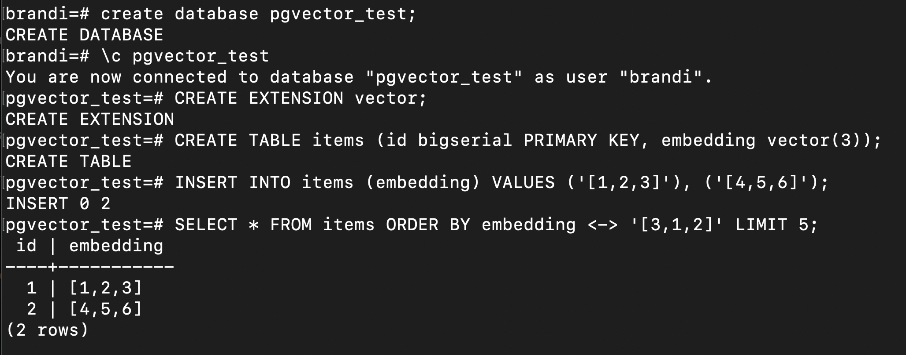

In the last lecture, we learned about vector databases. Let’s go through the setup to create a vector database and generate some embeddings for it to prepare for our RAG application.

# Creating & Populating a Vector DB for Launch School Book Search Assistant

### 1. Make sure you have PostgreSQL installed with version 13 or newer

### 2. Install PGVector:

**With Homebrew**:
```
brew install pgvector
```

**From source (Mac & Linux)**:
```
mkdir tmp
cd tmp
git clone --branch v0.8.0 <https://github.com/pgvector/pgvector.git>
cd pgvector
make
make install # may need sudo

rm -rf tmp
```

**Windows**: [Follow these instructions.](https://github.com/pgvector/pgvector?tab=readme-ov-file#windows)

> If you run into issues, explore the [pgvector README here](https://github.com/pgvector/pgvector?tab=readme-ov-file). They also have a section specifically dedicated to [frequent installation issues](https://github.com/pgvector/pgvector?tab=readme-ov-file#installation-notes---linux-and-mac).


### 3. Test your installation

[Follow the “Getting Started” steps](https://github.com/pgvector/pgvector?tab=readme-ov-file#getting-started). Note that these steps implicitly begin with connecting to PostgreSQL and creating a new database. Here are the outputs you should expect:



You can delete the `pgvector_test` database.

### 4. Generate Embeddings & Connect to your database

1. Create a new database, `book_search`.

2. From the project root, run:

    ```
    poetry install
    ```

    This will create a virtual environment and install all dependencies.

    To activate the environment, use:
    ```
    eval $(poetry env activate)
    ```

3. Create a `.env` file with `OPENAI_API_KEY=your_api_key`.

4. Read through the code in `setup_db.py`. Run `python setup_db.py`. You should see the message "Database setup complete!"

5. Read through the code in `load_embeddings.py`. Run `python load_embeddings.py`. You should see output like this:
    ```
    ...
    Stored embedding for: Advanced Data Structures and Algorithms: Practice:...
    Stored embedding for: Advanced Data Structures and Algorithms: Introduct...
    Stored embedding for: Advanced Data Structures and Algorithms: Terminolo...
    Stored embedding for: Advanced Data Structures and Algorithms: Problem S...
    Stored embedding for: Advanced Data Structures and Algorithms: Template...
    Stored embedding for: Advanced Data Structures and Algorithms: Demo: Per...
    Stored embedding for: Advanced Data Structures and Algorithms: Practice:...
    Stored embedding for: Advanced Data Structures and Algorithms: Conclusio...
    Processed batch 4/4
    All embeddings stored successfully!
    ```

7. Test your setup. After you've successfully ran `setup.py` and `load_embeddings.py`, connect to postgres to verify:

    ```
    psql -d book_search
    ```

    Run a simple query to check our embeddings:
    
    ```
    SELECT id,
           book_title,
           chapter_title,
           chapter_url,
           substr(embedding::text, 1, 50) || '...' as truncated_embedding
    FROM book_chapter
    LIMIT 15;
    ```

### 5. Compare Vectors with Cosine Similarity

**Basic Cosine Similarity Search**

The cosine similarity operator in pgvector is <=>. Here's an example of how to find the most similar book chapters:

```
-- Find 5 most similar chapters to a given vector
SELECT id, book_title, chapter_title, chapter_url, 
       embedding <=> '[0.1, 0.2, 0.3]'::vector AS similarity
FROM book_chapter
ORDER BY embedding <=> '[0.1, 0.2, 0.3]'::vector
LIMIT 5;
```

Note that **this query will not work directly with our database**, because this example uses an embedding with only 3 elements, whereas our database contains embeddings with 1,536 elements. To make it work, we'll need to retrieve embeddings with the correct dimensionality from subqueries and use them in statements like this.

**Converting Cosine Distance to Similarity**

Since pgvector returns cosine distance (where lower is better), convert to similarity:

```
-- Convert distance to similarity score (1 is most similar, 0 is least similar)
SELECT id, book_title, chapter_title, chapter_url, 
       1 - (embedding <=> '[0.1, 0.2, 0.3]'::vector) AS cosine_similarity
FROM book_chapter
ORDER BY cosine_similarity DESC
LIMIT 5;
```

**A working Query**
This query fetches the embedding for our “Backtracking” chapter and uses it to look up similar chapters.

```
-- Find 3 most similar chapters to "Introduction to Backtracking"
WITH backtracking_embedding AS (
  SELECT embedding
  FROM book_chapter
  WHERE chapter_title ILIKE '%backtracking%'
  LIMIT 1
)
SELECT
  book_title,
  chapter_title,
  chapter_url,
  1 - (embedding <=> (SELECT embedding FROM backtracking_embedding)) AS similarity
FROM book_chapter
WHERE 1 - (embedding <=> (SELECT embedding FROM backtracking_embedding)) > 0.4
  AND chapter_title NOT ILIKE '%backtracking%'  -- Exclude the reference chapter
ORDER BY similarity DESC
LIMIT 3;
```